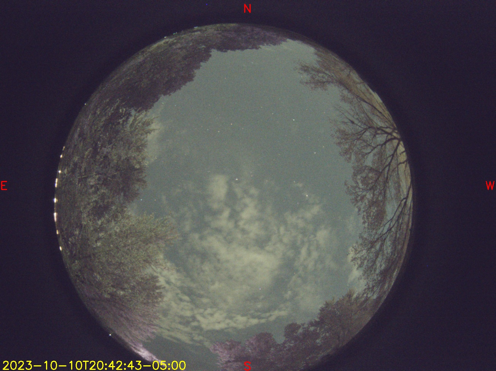
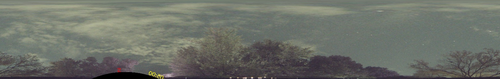

# Install
```
pip install
```

Make sure to compile optimized version of generate_pano, will probably be over 200 times faster.

```
python setup.py build --inplace
```

# Usage
```
> import fish2pano
> myimg = ... # Load numpy of shape (W, H, 3) representing the image
> radius = 481 # How big a circle your fisheye image is in pixels
> center = [618, 538] # Center of your fisheye image
> scale = 0.5 # How big the resulting pano is compared to the original
> mypano = fish2pano(myimg, radius, center, scale) # numpy array of your new pano image 
```

# Command Line and Graphical tools

See [fish2panoui](https://github.com/bluthen/fish2panoui) repo for command line and graphical tools to turn fisheye image to panoramic.

It also has a tool "findcircle.py" that helps you find the radius and center of the fisheye in your image.

## Example



```
python fish2panoui.py large2.jpg 481 618,538 0.5 large2_pano.jpg
```



